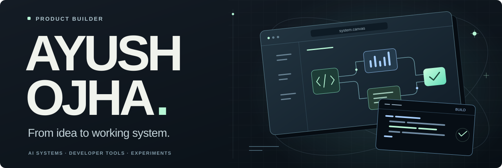
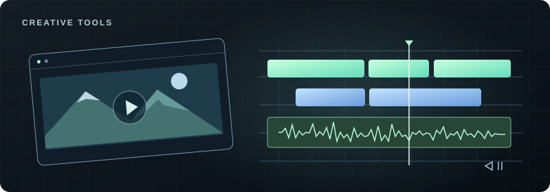
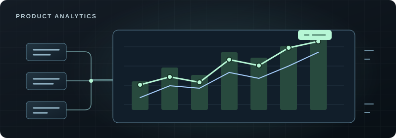
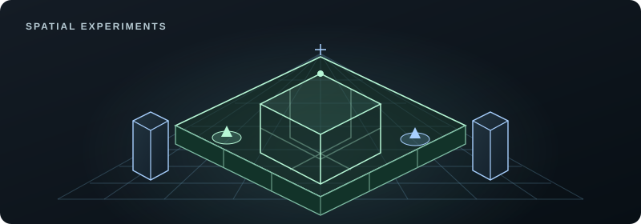
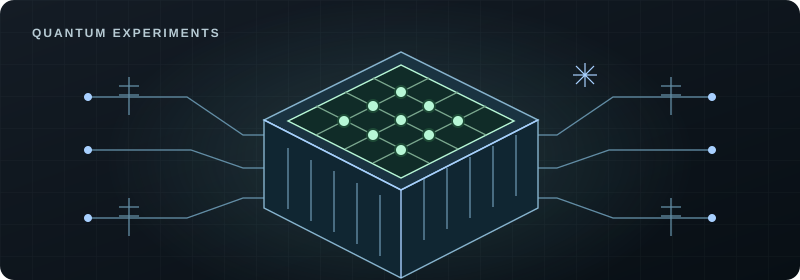

  

  <a href="https://ayushojha.com"><b>Website</b></a> &nbsp; / &nbsp;
  <a href="https://www.linkedin.com/in/ayushozha/">LinkedIn</a> &nbsp; / &nbsp;
  <a href="https://x.com/ojhaayush">X</a> &nbsp; / &nbsp;
  <a href="https://github.com/ayushozha?tab=repositories&type=source">Explore the repos</a>

  

I’m a product builder who writes the code, too. I turn ideas into AI tools, developer software, and research experiments you can explore below.

## Open-source contributions

Merged contributions to **Wasmer**, **TensorFlow**, **Microsoft / Playwright**, and **NVIDIA / tiny-cuda-nn**. Each logo opens a pull request I authored.

  
  
  
  

What I contributed

- **Wasmer:** [Safe internal image names for ZIP builds](https://github.com/wasmerio/anybuild/pull/119).
- **TensorFlow:** [A tensor-aware recomputation cost model](https://github.com/tensorflow/tensorflow/pull/109358) and [singular-matrix detection in GPU linear solves](https://github.com/tensorflow/tensorflow/pull/112658).
- **Microsoft / Playwright:** [Guidance on component-testing pitfalls](https://github.com/microsoft/playwright/pull/40064).
- **NVIDIA / tiny-cuda-nn:** [CUTLASS updates and build flags for newer headers](https://github.com/NVlabs/tiny-cuda-nn/pull/535).

## Featured build

### [Premiere Pro MCP ↗](https://github.com/ayushozha/AdobePremiereProMCP)

An open-source bridge between AI assistants and Adobe Premiere Pro, for supported editing workflows.

`Go` · `Rust` · `Python` · `TypeScript`

[Source](https://github.com/ayushozha/AdobePremiereProMCP) &nbsp; / &nbsp; [Setup & supported workflows](https://github.com/ayushozha/AdobePremiereProMCP#readme)

## More things I’m building

<table>
<tr>
<td width="50%" valign="top">

<h3><a href="https://github.com/ayushozha/markdown-viewer">Markdown Viewer</a></h3>

Markdown preview and editing with math, diagrams, and AI rewriting. Published on the VS Code Marketplace.

<code>TypeScript</code> <code>VS Code</code> <code>Electron</code>

<a href="https://github.com/ayushozha/markdown-viewer">Source</a> &nbsp; / &nbsp; <a href="https://marketplace.visualstudio.com/items?itemName=ayushojha.markdown-viewer-enhanced">Install →</a>

</td>
<td width="50%" valign="top">

<h3><a href="https://github.com/ayushozha/analytics-service">Pulse Analytics</a></h3>

Self-hosted web analytics with a Rust API, a dashboard, and a TypeScript SDK.

<code>Rust</code> <code>PostgreSQL</code> <code>Redis</code>

<a href="https://github.com/ayushozha/analytics-service">Source</a> &nbsp; / &nbsp; <a href="https://github.com/ayushozha/analytics-service#readme">Architecture →</a>

</td>
</tr>
<tr>
<td width="50%" valign="top">

<h3><a href="https://github.com/ayushozha/code-arena">Code Coliseum</a></h3>

An experimental 3D interface for AI code review, repair, and verification.

<code>TypeScript</code> <code>React</code> <code>Three.js</code>

<a href="https://github.com/ayushozha/code-arena">Source</a> &nbsp; / &nbsp; <a href="https://github.com/ayushozha/code-arena#readme">Explore →</a>

</td>
<td width="50%" valign="top">

<h3><a href="https://github.com/ayushozha/lifegraph">LifeGraph</a></h3>

A graph-based planning prototype that explores how changing constraints affect your next decision.

<code>Neo4j</code> <code>React</code> <code>Express</code>

<a href="https://github.com/ayushozha/lifegraph">Source</a> &nbsp; / &nbsp; <a href="https://github.com/ayushozha/lifegraph#readme">Explore →</a>

</td>
</tr>
</table>

## Research bench

### [CryoBrain ↗](https://github.com/ayushozha/CryoBrain)

A research environment for exploring quantum error-correction decoders and their hardware costs.

`Python` · `Stim` · `Verilator` · `Yosys`

[Source & experiments](https://github.com/ayushozha/CryoBrain#readme) &nbsp; / &nbsp; [Research presentation](https://ayushozha.github.io/CryoBrain/)

---

**Working on developer tools or a useful AI workflow?** [Let’s talk.](https://ayushojha.com/contact)
